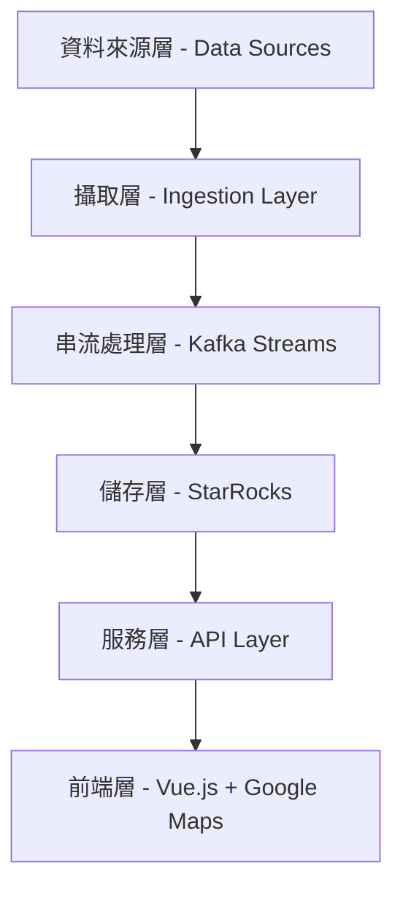

# TWFoundry 專案架構說明

## 1. 專案目標

**TWFoundry** 是一個類似 **Palantir Foundry** 風格的台灣資料作業系統（Data Operating System）。

本專案旨在將台灣多個重要的開放資料來源進行整合、清洗、融合，並以統一且直觀的視覺化方式呈現，打造一個現代化的智慧城市監控與指揮中心平台。

**目前 Phase 1 範圍**：

- 整合 YouBike、台北捷運 LiveBoard、Civil IoT 等開放資料
- 建立清晰且可維護的資料處理流程
- 開發以 Google Maps 為主的視覺化 Dashboard
- 保持架構簡單，方便後續擴展

## 2. 整體系統架構

## 3. 各層詳細說明

### 3.1 資料來源層 (Data Sources)

- **YouBike 即時站點資料**：每 1 分鐘更新一次
- **TDX 台北捷運 LiveBoard**：每 30 秒 ~ 2 分鐘更新
- **Civil IoT SensorThings API**：空氣品質、水位、雨量等（每 1~10 分鐘更新）
- **MRT 靜態資料**：GTFS 格式（車站資訊、路線形狀）

### 3.2 攝取層 (Ingestion Layer)

- 負責定期從各開放資料 API 取得資料
- 在資料中加入 `ingested_at`、`source` 等元資料欄位
- 將原始資料推送至 **Kafka**
- **建議 Kafka Topics**：
  - `raw.youbike`
  - `raw.mrt.liveboard`
  - `raw.ciot`
  - `raw.mrt.static`

### 3.3 串流處理層 (Kafka Streams Layer)

- 使用 **Spring Boot + Kafka Streams** 實作
- 主要負責：
  - 資料清洗與驗證
  - 計算衍生欄位（例如 YouBike 空車率、MRT 延誤秒數）
  - 簡單的資料融合處理
  - 將處理後的結構化資料寫入下游 Kafka Topic

### 3.4 儲存層 (Storage Layer)

- **資料庫**：**StarRocks**
- 使用 **Primary Key Table** 設計，方便更新最新站點狀態
- 建議表格：
  - `youbike_status`
  - `mrt_liveboard`
  - `ciot_observations`
  - `station_master`（靜態車站與路線資料）

### 3.5 服務層 (API Layer)

- 使用 Spring Boot 提供 RESTful API
- 負責將 StarRocks 中的資料以簡潔格式提供給前端
- 可視需求加入快取機制

### 3.6 前端層 (Frontend Layer)

- **技術**：Vue 3 + Pinia + Google Maps JavaScript API
- 主要功能：
  - 顯示台北捷運路線（Polyline）
  - 顯示 YouBike 與 MRT 車站（動態 Markers）
  - 疊加 Civil IoT 環境資訊（熱力圖或顏色變化）
  - 提供清晰的監控儀表板與操作介面

## 4. 技術棧

- **後端**：Spring Boot 3 + Gradle + Kafka Streams
- **訊息佇列**：Kafka
- **資料庫**：StarRocks
- **前端**：Vue 3 + Google Maps JavaScript API
- **資料來源**：TDX 運輸資料平台、YouBike 公開 API、Civil IoT

## 5. 設計原則

- 優先保持架構簡單與可維護性
- 先聚焦在資料流程穩定與 Dashboard 視覺化
- 後續可根據需求逐步加入更複雜的功能（如進階聚合、異常偵測、歷史分析等）

## 6. 後續擴展方向（供參考）

- 增加歷史資料趨勢分析與物化視圖
- 支援更多縣市交通與環境資料
- 加入更複雜的即時計算與告警機制
- 擴展前端操作功能

## 7. Repo Name

建議 repo name：`twfoundry`。
