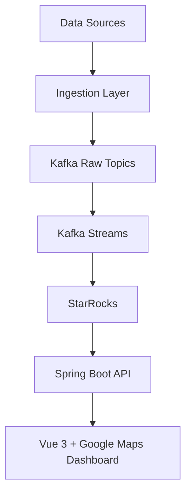

# Design: Bootstrap TWFoundry Platform

## Overview

TWFoundry Phase 1 is a Taiwan data operating system focused on open data ingestion, simple stream processing, current-state storage, and map-based visualization.

The target architecture is intentionally direct:



Implementation starts with a narrower MRT-only frontend slice:

```text
Vue 3 dashboard -> mock MRT fixtures -> Google Maps / mock map provider
```

The backend pipeline is added after the dashboard interaction model and MRT API contract are visible.

Detailed backend contracts, Kafka topic ownership, StarRocks table schemas, and local infrastructure setup are deferred to `openspec/changes/define-backend-platform-contracts` so this bootstrap change can close around the frontend-first slice.

## Source Coverage

Phase 1 source candidates:

- YouBike realtime station status, refreshed around every minute.
- TDX Taipei MRT LiveBoard, refreshed around every 30 seconds to 2 minutes.
- Civil IoT SensorThings observations such as air quality, water level, and rainfall, refreshed around every 1 to 10 minutes.
- MRT static GTFS data for station information and route shapes.

## Layer Responsibilities

### Data Sources

Source APIs remain external dependencies. TWFoundry treats them as inputs and does not expose raw source payloads directly to the frontend.

### Ingestion

Ingestion services poll source APIs, attach metadata such as `ingested_at` and `source`, and publish raw records to Kafka.

Initial raw topics:

- `raw.youbike`
- `raw.mrt.liveboard`
- `raw.ciot`
- `raw.mrt.static`

### Kafka Streams

Kafka Streams processors validate, clean, normalize, and enrich raw records. Derived fields include metrics such as YouBike empty-dock ratio and MRT delay seconds when source data supports them.

The streams layer publishes structured downstream records for storage and API use.

### Storage

StarRocks is the Phase 1 database. Current-state tables should use Primary Key Table design where latest station or observation state needs to be updated.

Initial tables:

- `youbike_status`
- `mrt_liveboard`
- `ciot_observations`
- `station_master`

### API

Spring Boot exposes RESTful endpoints that return frontend-ready resource shapes from StarRocks. Source-specific payload details should stay behind the API boundary.

Caching can be added where dashboard read patterns justify it, but it is not a Phase 1 requirement by default.

### Frontend

The first implementation slice is frontend-first and MRT-only.

Frontend stack:

- Bun for package management and scripts.
- Vite for the Vue development server and build.
- Vue 3 with TypeScript.
- Pinia for selected station, layer state, and LiveBoard state.
- Vue Router, even if the first version only serves the dashboard route.
- Google Maps JavaScript API for the real local/demo map.
- Vue scoped CSS for first-version styling.
- Vitest for small unit and integration tests.
- Playwright for a smaller E2E smoke suite after the unit/integration layer is stable.

Initial dashboard capabilities:

- Render Taipei MRT route polylines.
- Render MRT station markers.
- Select a station from the map.
- Open a right-side LiveBoard panel for the selected station.
- Show mock LiveBoard rows with direction, destination, estimated arrival, and status.
- Provide basic MRT layer controls.

The first version should use TypeScript mock fixtures as the MRT data contract. YouBike and Civil IoT layers are deferred until the MRT path is proven.

### Dashboard Design Source

The committed dashboard mockup should be the current visual design source of truth for the dashboard experience. The first design source should cover:

- MRT map dashboard layout.
- Station marker interaction states.
- LiveBoard side panel states for empty selection, selected station, no arrivals, and delayed arrivals.
- Layer control states for visible and hidden MRT lines.
- Responsive layout expectations for desktop and mobile widths.

The implementation does not need pixel-perfect parity during early frontend iteration, but meaningful UI changes should either come from the design source or be reflected back into it after validation.

Design source:

- `design/mrt-liveboard-mockup.html`

Current implementation sync:

- The Vue MRT dashboard has been styled from the committed mockup while preserving the existing mock map provider, station selection, layer toggles, and LiveBoard panel behavior.

Initial mock/static MRT scope:

- Red Line: Taipei Main Station, Daan, Xiangshan.
- Blue Line: Taipei Main Station, Zhongxiao Fuxing, Taipei City Hall.
- Green Line: Ximen, Chiang Kai-shek Memorial Hall, Nanjing Fuxing.

This scope intentionally includes multiple line colors, representative station markers, and transfer-like operational cases while keeping the first dataset small enough to maintain by hand.

### Map Provider Boundary

The frontend should support a map provider setting:

```text
VITE_MAP_PROVIDER=google | mock
```

- `google` uses Google Maps JavaScript API and requires `VITE_GOOGLE_MAPS_API_KEY`.
- `mock` provides a deterministic map surface for Playwright E2E and CI.

Playwright tests should default to the mock map provider so core UI behavior is not coupled to Google Maps network availability, quota, tile loading, or API key access.

### Test Strategy

Testing should grow from small to broad:

1. Unit tests with Vitest for MRT fixture shape, station lookup helpers, and LiveBoard data selection.
2. Integration-style tests with Vitest for Pinia store behavior, including selected station state and MRT layer toggles.
3. Provider boundary tests for `VITE_MAP_PROVIDER=google | mock`, ensuring invalid or missing values fail loudly instead of silently selecting the wrong map mode.
4. Playwright E2E only after the dashboard is wired, focused on a small smoke suite: dashboard load, station selection, and layer toggle.

This keeps early feedback fast while preserving E2E coverage for the user-facing flow once the UI is stable.

### CI Strategy

CI should start with the frontend slice and run on pull requests and pushes to the main branch.

Required frontend CI checks:

1. Install frontend dependencies with Bun from `frontend/bun.lockb`.
2. Run TypeScript type checking through the production build command.
3. Run Vitest unit and integration tests.
4. Install the Playwright Chromium browser used by the E2E project.
5. Run Playwright E2E smoke tests in isolated `--mode e2e` mock-map mode.

Linting or formatting checks should be added as a separate step after the project chooses the lint rule set. Until then, CI should still enforce type checking, build, unit/integration tests, and E2E tests.

## Repository Shape

The repository should start as a simple monorepo:

```text
twfoundry/
  docs/
  openspec/
  backend/
    ingestion/
    streams/
    api/
  frontend/
  infra/
```

This shape keeps contracts and local development notes close together while the platform is still small.

## Design Principles

- Keep the architecture simple and maintainable.
- Prioritize a visible MRT dashboard and stable frontend contract before backend data flow.
- Defer advanced aggregation, anomaly detection, alerting, historical analytics, and broader city support until the Phase 1 loop is proven.

## Risks

- TDX authentication, quota, and rate limits may constrain MRT ingestion cadence.
- Civil IoT data can vary by observed property and may require flexible normalization.
- Google Maps API key management must avoid committed secrets.
- Real Google Maps E2E runs can be flaky in CI; the mock provider mitigates this.
- StarRocks and Kafka local development may require setup work before application code is useful.
