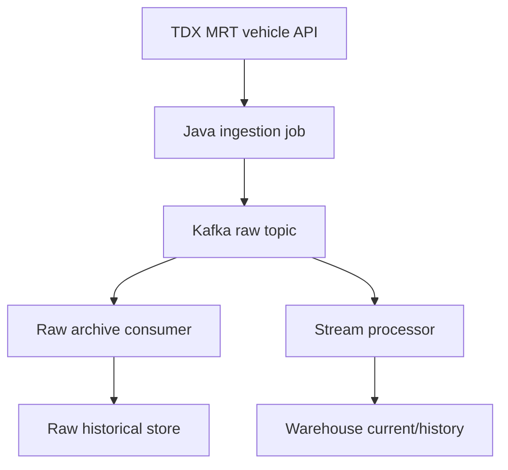

## Context

TWFoundry overlay data falls into different freshness classes:

- Static reference overlays such as MRT stations, routes, and boundaries.
- Periodic snapshots such as YouBike status or AQI station values.
- Near-real-time overlays such as MRT vehicle positions or Civil IoT observations.
- Operator overlays such as annotations, incident markers, and manual corrections.

Only near-real-time or audit-worthy data should be forced through Kafka. Static reference data can be imported directly into serving/reference storage. Snapshot data can upsert latest-state tables directly unless replay, audit, or analytics requirements justify Kafka.

## Goals / Non-Goals

**Goals:**

- Keep ingestion single-write for near-real-time raw data: publish once to Kafka.
- Let independent Kafka consumers fan out to raw historical archive and stream projection.
- Preserve raw facts append-only while projecting resolved facts for current warehouse reads.
- Make data-conflict handling explicit with source authority, revision, confidence, and deterministic tie-breakers.
- Keep implementation as framework-light Java contracts and tests for this change.

**Non-Goals:**

- Running Kafka or Airflow locally.
- Building full storage adapters for StarRocks, PostGIS, or object storage.
- Building the frontend overlay view.
- Building an end-to-end MRT vehicle source connector.

## Decisions

### Kafka Raw Topic Is the Single Production Write

Near-real-time ingestion publishes each raw envelope once:



The ingestion job does not double-write to object storage or warehouse. Archive durability is owned by a consumer group so Kafka fan-out remains the integration boundary.

### Raw Historical Store Is Source-of-Truth for Replay

Kafka retention should not be the long-term replay boundary. The raw archive stores partitioned `RawEnvelope` data by source, dataset, date, and run mode. Replay jobs read the raw archive and produce isolated replay topics or feed isolated projector executions.

### Warehouse Stores Raw, Resolved, and Conflict Facts

The serving/warehouse layer should distinguish:

- raw facts: append-only observations and source candidates
- resolved facts: canonical values selected by policy
- conflict facts: candidates requiring deterministic or manual resolution

Current overlay tables should read resolved facts, while timeline/debug surfaces can expose raw and conflict records.

### Data Conflict Is Not Offset Conflict

Snapshot/change merging has two separate classes of conflict:

- Time/order conflict: handled with event time, revision, sequence, snapshot boundary, or replay isolation.
- Data conflict: handled with source authority, source mode, revision, confidence, and deterministic tie-breakers.

For example, a historical snapshot can correct a value first observed from a live WebSocket stream. That correction should supersede the live value when its authority is higher, while both candidates remain available in raw/history tables.

### Topic Taxonomy

The backend introduces versioned topic helpers:

```text
source.<source>.<dataset>.raw.v1
source.<source>.<dataset>.raw.replay.<run_id>
twf.observations.<type>.v1
twf.overlay.events.v1
twf.audit.events.v1
```

Existing legacy topic helpers remain available for compatibility.

## Risks / Trade-offs

- Archive consumer lag can delay historical replay availability even when live projection is current.
- Authority ranking can encode domain assumptions too early; tests should keep policy explicit.
- External APIs may not provide strict source offsets, so TWFoundry must rely on event time plus deterministic tie-breakers until a better source sequence exists.
- The current change defines contracts, not production Kafka/Airflow runtime wiring.
